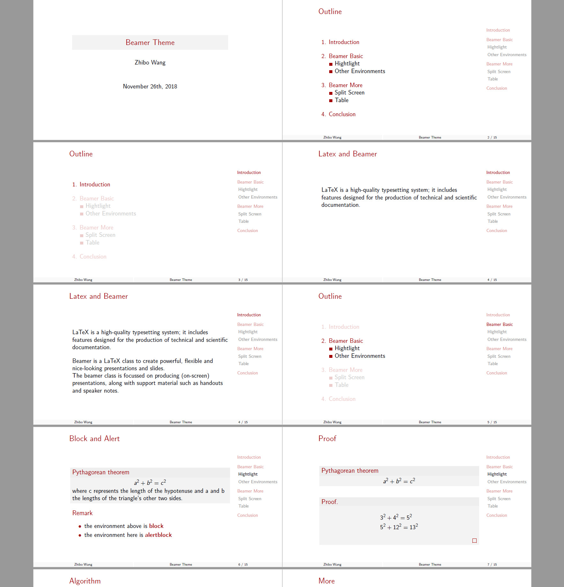
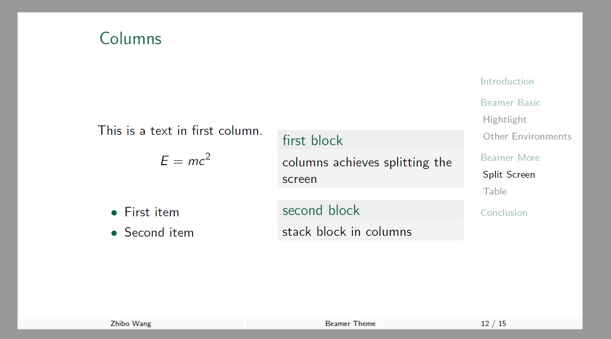
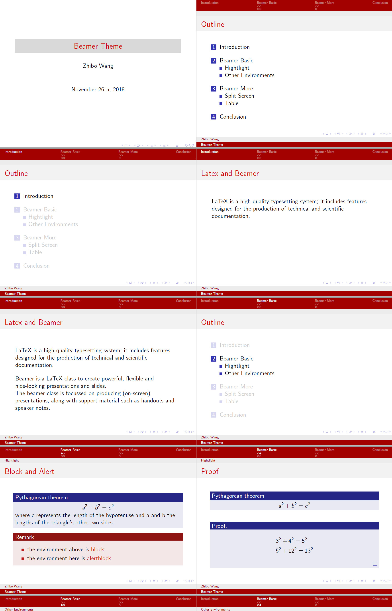

# BeamerTheme

## Introduction

Beamer has a lot of themes which are build-in([Beamer Matrix](https://hartwork.org/beamer-theme-matrix/)) or developed by others([overleaf](https://www.overleaf.com/gallery/tagged/presentation), [github](https://github.com/martinbjeldbak/ultimate-beamer-theme-list)). But there is almost no satisfaction for me. What I mainly focus on is just **simple colors** and **clear navigation**. So I made a simple theme for myself by modifying the defaut theme. I will be encouraged if you like it too.

The value of this project is as follows

- a template easy to be applied, easy to change the color, easy to change the way of navigation
- a content tex file to test the beauty of other themes

## Demos

Here, I will show two main kinds of output with different aspect ratio(ratio of width to height). You can change the theme color and the way of navigation conveniently. See more [examples](examples) here.


[simple source](simple.tex)



[sidebar source](bar169.tex)

## Usage

The main file is `beamerthemeSimple.sty`. Make sure it is in the same folder as your tex file(Or [global path](https://tex.stackexchange.com/questions/1137/where-do-i-place-my-own-sty-or-cls-files-to-make-them-available-to-all-my-te/214080)). Here is a simplfied tex file.

```latex
\documentclass{beamer}
    \usepackage[english]{babel}
    
    % customize your own color and navigation
    \usetheme[RGB={12 72 66}]{Simple} % color
    \useoutertheme{tree}              % navigation
    
    \author{Your Name}
    \title{Your title}
    \date{November 29th, 2018}

    \begin{document}
        \frame[plain]{\titlepage}
        \section{Introduction}
        \begin{frame}
            \frametitle{Latex and Beamer}
            LaTeX is a high-quality typesetting system; 
            it includes features designed for the production of 
            technical and scientific documentation.
        \end{frame}
    \end{document}
```

You can change the color and the way of navigation as you like. I will talk about the two topics in detail.

## Color

There will be only one unified color in the slides with this theme. You can change the overall color by setting RGB.

```
\usetheme[RGB={12 72 66}]{Simple}
```

Or HEX

```
\usetheme[HTML=A30000]{Simple}
```

Here are some colors I like. You can see the output in [examples](examples).

```
HTML=096148      % green
RGB={12 72 66}   % bluegreen
HTML=8D742A      % brown
RGB={163 0 0}    % red
```
You can search for beautiful colors [here](http://nipponcolors.com). 

Or just generate three RGB values by heart. You may find the output is surprisingly beautiful when the three value are all below 100.


## Navigation

For a long-time presentation, a suitable navigation is necessary. I selected four ways of navigation with different advantages.(**focus on the top of each slide**)

### 1. split

All sections and subsections for the current section are displayed on the top of each page. It contains a lot of information. But it will become too fat if there are too many sections. Maybe deviding the presentation into several parts with command `\part` will help.


Load this navigation by

```
\useoutertheme{split}
```

### 2. tree

It is concise for only displaying the current section and subsection. It's recommended when the structure of this presentation is clear itself.


Load this navigation by

```
\useoutertheme{tree}
```

### 3. miniframes

This navigation displays all sections and the current subsection. More importantly, the navigation dots can show the progress of each subsection.


Load this navigation by

```
\useoutertheme{miniframes}
```

However, the dots placed in two lines may confuse those who have never touched it. Therefore, I recommend to use it when there are no subsections so that the dots will be placed in one line. The navigation dots will work for section if you set as follows.

```
\useoutertheme[subsection=false]{miniframes}
```


### 4. sidebar

It will display all sections and subsections on the right bar. It contains most information comparing with ways before. But it is not proper if there are too many topics to display.



Comparing with the previous outerthemes, I modified more after loading the built-in `sidebar` outertheme which I am not quite satisfied with. However, it may bring some side effect such as complict with Chinese and some settings of layout. But we can play with it well in most cases.

Here is the usage of this theme which is kind of different from before.

```
\documentclass[aspectratio=169]{beamer}
    \usepackage[english]{babel}
    \usetheme[RGB={12 72 66}]{Bar169}

    \author{Your Name}
    \title{Your Title}
    \date{November 29th, 2018}

    \begin{document}
        \frame[plain]{\titlepage}
        \section{Introduction}
        
        \begin{frame}
            \frametitle{Latex and Beamer}
            LaTeX is a high-quality typesetting system; 
            it includes features designed for the production of 
            technical and scientific documentation.
        \end{frame}
    \end{document}
```

Several points to pay attention to

- Specify the ratio at the beginning `aspectratio=169`.
- Use theme `Bar169` rather than `Simple`.
- Don't need to specify the outertheme.

Other things are the same. You can change the color in the same way.

## Test other themes

The `content.tex` contents many elements and enough sections to test what a theme looks like. 

### Built-in themes

Build a `test.tex` file in this folder and fill in the code below.
```
\documentclass{beamer}
    \usetheme{Berlin}
    \usecolortheme{beaver}
    \input{pkgs.tex}
    \author{Your Name}
    \title{Beamer Theme}

    \begin{document}
        \input{content.tex}
    \end{document}
```
You will get 



### Download themes

For example, we test [this theme](https://github.com/matze/mtheme)

```
\documentclass{beamer}
    \usetheme{metropolis}
    \input{pkgs.tex}
    \author{Your Name}
    \title{Beamer Theme}

    \begin{document}
        \input{content.tex}
    \end{document}
```

You will get 


I have to say that it is quite beautiful! But without navigation, it may be more appropriate to be used when having a short presentation.

However, you can achieve most of this effect by changing my 'simple' theme.


------------------

**Besides, it is more flexible to add the navigation.**

